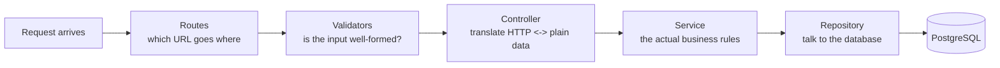

# A Guided Tour of GoMe

*A file-by-file walkthrough of the codebase, presented for anyone who wants to understand how the app is put together — no prior familiarity with the code required.*

---

## 1. What Is GoMe?

GoMe is a small banking backend. It lets someone sign up, log in, open one or more bank accounts, fund them, withdraw money, transfer money to their own or someone else's account, lock an account, and check a balance — all protected by a login token *and* a 4-digit transaction PIN for anything that moves money out of an account.

It's built with **Node.js, TypeScript, Express, and PostgreSQL** (via a query-building library called Knex).

---

## 2. The Mental Model

Two things exist in this system, and everything else exists to serve them:

- **A User** — someone with an email, a name, a password, and a transaction PIN.
- **An Account** — a bank account, owned by exactly one user, identified by a unique account number, holding a balance.

A user can own several accounts. Every request to move money touches one or two accounts and always leaves a paper trail (a **transaction** record).

Every request follows the same path through the code, regardless of which feature it's hitting:

Keeping each of those five stops in its own file, doing exactly one job, is the single biggest organizing idea in this codebase. Once you know that, every file's purpose becomes predictable from which folder it lives in.

---

## 3. Where the App Starts

| File | What it's for |
|---|---|
| `src/server.ts` | The very first thing that runs. Checks the database is reachable, then starts listening for HTTP requests on a port. If the database isn't reachable, it logs the problem and shuts down rather than pretending to work. |
| `src/app.ts` | Builds the Express application itself: wires up every piece of middleware in the correct order (security headers → CORS → rate limiting → JSON parsing → response helper → routes → 404 handler → error handler), then hands the finished app to `server.ts`. Kept separate from `server.ts` so tests can import the app directly without starting a real network server. |

---

## 4. `src/common/` — Shared Building Blocks

Small, dependency-free helpers that every other layer relies on.

| File | What it's for |
|---|---|
| `errors.ts` | Defines `AppError` — a custom error that carries an HTTP status code alongside its message. Whenever the app needs to say "this request failed, and here's why," it throws one of these instead of manually building an error response. |
| `http.ts` | A single source of truth for HTTP status code numbers (`HTTP.NOT_FOUND`, `HTTP.BAD_REQUEST`, etc.), so nobody has to remember or mistype `404` by hand. |
| `asyncHandler.ts` | A small wrapper around `async` route handlers. Express doesn't automatically catch errors thrown inside `async` functions — this wrapper makes sure it does, so a failed database call doesn't crash the server. |
| `logger.ts` | The app's logger (built on a library called Winston). Every important event — a user registering, a withdrawal, a failed login — is written here with a timestamp, a severity level (`INFO`, `WARN`, `ERROR`, `DEBUG`), and extra context like which user or account was involved. Never logs passwords, PINs, or tokens. |
| `money.ts` | Converts between the amounts people type (like `"100.50"`) and the whole-number-of-cents format the database stores (`10050`). Money is *never* handled as a floating-point number anywhere in this app, because floating-point math can silently lose fractions of a cent — this file is what makes that guarantee possible. |
| `accountNumber.ts` | Generates a random 10-digit account number when a new bank account is opened. |

---

## 5. `src/database/` — The Connection to PostgreSQL

| File | What it's for |
|---|---|
| `connection.ts` | Creates the one shared connection to the database that the rest of the app reuses, and offers a way to double-check the database is actually reachable at startup. |
| `knexfile.ts` | Configuration: which database to connect to, using which credentials, and where migration files live. |
| `migrations/20260729230000_create_users_table.ts` | The very first migration — creates the `users` table (email, password, login token). |
| `migrations/20260730012545_add_full_name_to_users_table.ts` | Adds a `full_name` column to `users`, so signup can capture a person's name, not just their email. |
| `migrations/20260730012546_add_pin_hash_to_users_table.ts` | Adds a `pin_hash` column to `users` — the securely-hashed transaction PIN. Never the raw PIN, only its hash. |
| `migrations/20260730012546_create_accounts_table.ts` | Creates the `accounts` table: which user owns it, its unique account number, its balance (in cents), and whether it's locked. |
| `migrations/20260730012547_create_transactions_table.ts` | Creates the `transactions` table — the permanent record of every funding, withdrawal, and transfer that has ever happened. |

*A "migration" is just a small, timestamped file that describes one change to the database's shape. Running them in order, oldest first, is how the database schema is built up incrementally and predictably.*

---

## 6. `src/middleware/` — Code That Runs on the Way In (and Out)

Middleware sits between "a request arrived" and "a controller handles it," doing something to every request that passes through — or, in the validators' case, checking specific requests before they're allowed further.

| File | What it's for |
|---|---|
| `security.ts` | Turns on baseline protections: security-related HTTP headers, cross-origin request restrictions, and a rate limiter that stops any one visitor from hammering the API. |
| `response.ts` | Adds a `res.success(...)` helper to every response, so every successful reply from the API has the same predictable shape: `{ message, data }`. |
| `responseLogger.ts` | Logs a line for every request that finishes: which method, which URL, what status code, how long it took. |
| `errorHandler.ts` | The single place that turns any thrown error into an HTTP response. If it's an `AppError`, it uses that error's status code and message; anything unexpected becomes a generic "something went wrong" 500 response instead of leaking internal details. Also logs 4xx errors as warnings and 5xx errors as full errors. |
| `auth.middleware.ts` | Reads the `Authorization: Bearer <token>` header, looks up which user that token belongs to, and attaches that user to the request. Every protected route relies on this having run first. |
| `validators/validate.ts` | The last step in every validation chain — if any check failed, turns that into a clear 400 error before the request ever reaches a controller. |
| `validators/auth.validators.ts` | Checks signup and login requests: full name present, email looks like an email, password is at least 8 characters. |
| `validators/user.validators.ts` | Checks PIN-setting requests: the new PIN (and, if changing an existing PIN, the current PIN) must be exactly 4 digits. |
| `validators/account.validators.ts` | Checks that an `:id` in a URL (like `/api/accounts/7/balance`) is actually a valid, positive whole number before anything tries to look it up. |
| `validators/transaction.validators.ts` | Checks funding/withdrawal/transfer requests: the amount is a valid, positive figure with at most two decimal places; the PIN is 4 digits; a transfer's destination account number is a valid 10-digit number. |

---

## 7. `src/models/` — What the Data Looks Like

Plain descriptions of each database row — no logic, just shape.

| File | What it's for |
|---|---|
| `user.model.ts` | Describes a user row (id, email, full name, password hash, PIN hash, login token, created date) — and a "safe" version of that shape that deliberately leaves out the password hash, PIN hash, and token, for anything that gets sent back to a client. |
| `account.model.ts` | Describes an account row (id, owning user, account number, balance, locked flag, created date). |
| `transaction.model.ts` | Describes a transaction row (id, type — funding/withdrawal/transfer in/transfer out —, amount, which account, which counterparty account if any, description, status, created date). |

---

## 8. `src/repositories/` — The Only Files That Talk SQL

Every database query in the app lives in one of these three files. No other file is allowed to query the database directly — that boundary is what makes it possible to reason about (and test) the business logic separately from the database.

| File | What it's for |
|---|---|
| `user.repository.ts` | Create a user, find one by email or by login token, update a user's token or PIN hash. |
| `account.repository.ts` | Create an account, find one by id or by account number, list all accounts for a user, update a balance, lock/unlock — including special versions of these queries that lock a row (`FOR UPDATE`) so two simultaneous withdrawals can't both read the same stale balance and overdraw the account. |
| `transaction.repository.ts` | Record a new transaction, look one up by id, list every transaction for a given account. |

---

## 9. `src/services/` — Where the Actual Rules Live

This is the heart of the app: what's *allowed* to happen, and what happens when it does. Services never touch HTTP directly — they take plain values in, return plain values out, or throw an `AppError` when a rule is broken.

| File | What it's for |
|---|---|
| `auth.service.ts` | Sign up (hash the password, create the user, issue a login token), log in (check the password, issue a fresh token), log out (clear the token), and look up "who does this token belong to." |
| `user.service.ts` | Set or change a transaction PIN (hashing it, and requiring the *current* PIN if one's already set), and verify a PIN is correct before a sensitive operation is allowed to proceed. |
| `account.service.ts` | Open a new account (with a guaranteed-unique account number), list a user's accounts, fetch a balance, lock or unlock an account — always double-checking the requester actually owns the account first. |
| `transaction.service.ts` | The money-moving core: fund an account, withdraw from an account, and transfer between two accounts. Every one of these runs inside a database transaction with the relevant account row(s) locked, so a crash or a concurrent request can never leave a balance half-updated or let two withdrawals both succeed when only one should. A transfer always PIN-checks and writes two linked records — one debit, one credit — so the full picture is always reconstructable later. |

---

## 10. `src/controllers/` — Translating HTTP into Plain Function Calls

Deliberately thin. Each controller reads the already-validated request, calls exactly one service function, and shapes the reply.

| File | What it's for |
|---|---|
| `auth.controller.ts` | Handles sign up, log in, log out, and "who am I." |
| `user.controller.ts` | Handles setting/changing the transaction PIN. |
| `account.controller.ts` | Handles opening an account, listing accounts, checking a balance, locking, and unlocking. |
| `transaction.controller.ts` | Handles funding, withdrawing, transferring, and listing an account's transaction history. |

---

## 11. `src/routes/` — The Address Book

Maps a URL and HTTP method to (validator →) controller. No logic lives here — just wiring.

| File | What it's for |
|---|---|
| `index.ts` | The root router — handles the "hello world" health-check route, and mounts every other route file under its URL prefix (`/api/auth`, `/api/users`, `/api/accounts`). |
| `auth.routes.ts` | `/api/auth/signup`, `/api/auth/login`, `/api/auth/logout`, `/api/auth/me`. |
| `user.routes.ts` | `/api/users/pin` — set or change the transaction PIN. |
| `account.routes.ts` | `/api/accounts` (create/list), `/api/accounts/:id/balance`, `/api/accounts/:id/lock`, `/api/accounts/:id/unlock`. |
| `transaction.routes.ts` | `/api/accounts/:id/fund`, `/api/accounts/:id/withdraw`, `/api/accounts/:id/transfer`, `/api/accounts/:id/transactions`. |

---

## 12. `tests/` — Proof the App Works

Two flavors of test, deliberately kept separate.

**Controller tests — fast, no real database, run every time**

| File | What it's for |
|---|---|
| `app.test.ts` | Sanity checks: the health-check route responds, unknown routes return a proper 404, security headers are present. |
| `auth.controller.test.ts` | Sign up / log in / log out / "who am I" — checked with the real validators but a stand-in (mocked) service layer. |
| `user.controller.test.ts` | Setting a transaction PIN, including the validation and error-propagation cases. |
| `account.controller.test.ts` | Opening/listing accounts, checking balances, locking/unlocking, including ownership and not-found error cases. |
| `transaction.controller.test.ts` | Funding, withdrawing, transferring, and listing transactions, including validation and error-propagation cases. |

**Service integration tests — slower, hit a real disposable test database**

| File | What it's for |
|---|---|
| `setup/testDb.ts` | Shared helper: connects to the real (isolated) test database and wipes it clean before every test. |
| `services/user.service.test.ts` | Proves PIN set/verify actually works against the database — including requiring the correct current PIN to change it. |
| `services/account.service.test.ts` | Proves account creation, the automatic retry when a random account number collides, and ownership checks all work for real. |
| `services/transaction.service.test.ts` | The most important test file in the project. Proves, against a real database, that: funding/withdrawing/transferring change balances correctly; insufficient funds and locked accounts are rejected *without* touching the balance; a failure partway through a transaction rolls back cleanly with nothing left half-done; and — critically — firing two simultaneous withdrawals that would jointly overdraw an account results in exactly one succeeding, never both. |

---

## 13. Configuration & Project Files

| File | What it's for |
|---|---|
| `package.json` | The project's identity, dependencies, and every runnable command (`npm run dev`, `npm test`, `npm run migrate`, etc.). |
| `package-lock.json` | An exact, reproducible record of every installed dependency's version — ensures "it works on my machine" also works on everyone else's. |
| `tsconfig.json` | Tells TypeScript how strictly to check the code and how to compile it to plain JavaScript. |
| `jest.config.ts` | Tells the test runner where to find test files and how to handle TypeScript. |
| `eslint.config.mjs` | The project's code-style and code-quality rules, enforced automatically. |
| `.prettierrc` | Formatting rules (spacing, quote style, line width) applied automatically. |
| `Dockerfile` | The recipe for building the app into a container image. |
| `docker-compose.yml` | Describes the two containers needed for local development — the app itself (`gome-api`) and a PostgreSQL database — and how they're wired together. |
| `.env` / `.env.example` | Environment-specific settings (database credentials, port, etc.) that the app reads at startup. `.env.example` is the template; `.env` is the real one. |
| `.gitignore` | Tells Git which files (like `node_modules` or `.env`) should never be committed. |
| `README.md` | The technical reference: how to install, run, test, and the full API surface. This tour is the narrative companion to it. |

---

## 14. The Whole Thing, One More Time

Someone calling `POST /api/accounts/7/withdraw` walks through:

1. **`routes/transaction.routes.ts`** matches the URL and method.
2. **`middleware/auth.middleware.ts`** confirms they're logged in.
3. **`middleware/validators/transaction.validators.ts`** confirms the amount and PIN are well-formed.
4. **`controllers/transaction.controller.ts`** hands the (now-trusted) values to the service layer.
5. **`services/transaction.service.ts`** checks the PIN, opens a database transaction, locks the account row, checks ownership/lock-status/sufficient-funds, updates the balance, and writes a transaction record — all atomically.
6. **`repositories/account.repository.ts`** and **`repositories/transaction.repository.ts`** are the only files that actually spoke SQL to make that happen.
7. **`middleware/response.ts`** shapes the reply; if anything went wrong anywhere along the way, **`middleware/errorHandler.ts`** shaped a clear error instead.

Every feature in the app — signing up, opening an account, transferring money — follows that same seven-step shape. Once it clicks for one feature, it clicks for all of them.
